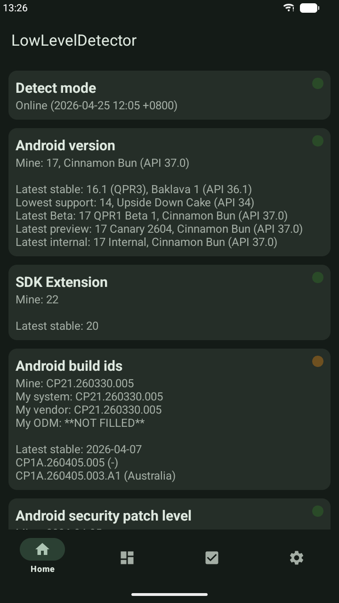
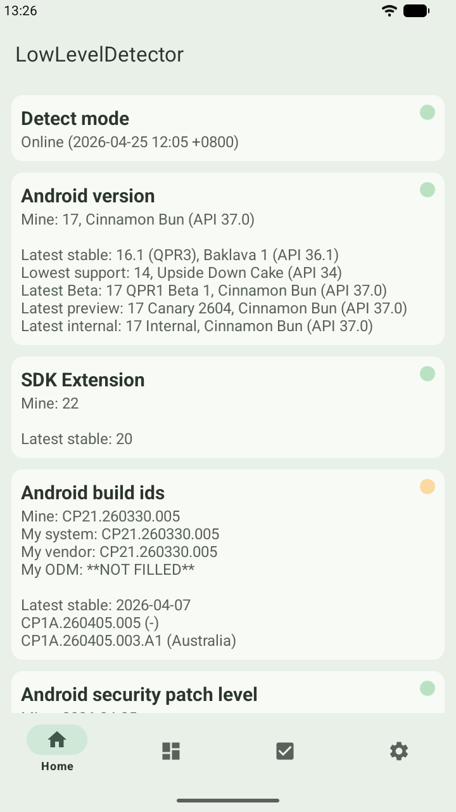

# AndroidLowLevelDetector

> 本文件是 [README.md](README.md) 的中文翻译.

[](https://github.com/imknown/AndroidLowLevelDetector/actions/workflows/android-ci.yml)
[](https://github.com/imknown/AndroidLowLevelDetector/actions/workflows/dependabot/dependabot-updates)
[](https://github.com/imknown/AndroidLowLevelDetector/actions/workflows/dependency-submission.yml)

检测 Treble, GSI, Mainline, APEX, system-as-root(SAR), A/B 等.  
部分源码参考了 [Magisk][Magisk], [OpenGApps][OpenGApps], [TrebleInfo][TrebleInfo], [TrebleCheck][TrebleCheck] 等.  

[Magisk]:https://github.com/topjohnwu/Magisk
[OpenGApps]:https://github.com/opengapps/opengapps
[TrebleInfo]:https://github.com/penn5/TrebleCheck
[TrebleCheck]:https://github.com/kevintresuelo/treble

 

## 来源
1. https://github.com/imknown/AndroidLowLevelDetector
1. https://gitee.com/imknown/AndroidLowLevelDetector (镜像)

## 下载
1. https://play.google.com/store/apps/details?id=net.imknown.android.forefrontinfo
1. https://github.com/imknown/AndroidLowLevelDetector/releases
1. https://gitee.com/imknown/AndroidLowLevelDetector/releases (镜像)

## 功能
<details>
<summary>点我</summary>

- 检测 Android 版本
- 检测 Android Build Id 版本
- 检测 Android 安全补丁级别
- 检测 Vendor 安全补丁级别
- 检测 Project Mainline 模块版本 (Google Play 系统更新)
- 检测 Linux 内核
- 检测 A/B 或 A-Only
- 检测动态分区
- 检测动态系统更新 (DSU)
- 检测 Project Treble
- 检测 GSI 兼容性
- 检测 Binder 位数
- 检测 进程/VM 架构
- 检测 Vendor NDK
- 检测 System-as-root
- 检测 (flattened) APEX
- 检测 Toybox
- 检测 WebView 实现
- 检测 outdatedTargetSdkVersion apk
- 支持深色模式
- 在线/离线模式 (从远程服务器或本地获取数据)
- 支持多窗口/自由窗口/折叠屏/横屏
- 等等

</details>

## 贡献
直接提 `Pull Request`.  
也欢迎贡献翻译.

## 构建
### Flavor
- Firebase  
Google Play 版本.  
会收集你的信息并上传,  
使用 Firebase Analytics & Crashlytics.  
遵循 Firebase 官方指南.  
见 [隐私政策][Privacy Policy].

- FOSS (默认)  
**不会**收集你的信息.  
见 [自由开源软件][FOSS].

[Privacy Policy]: /GOOGLE_PLAY_PRIVACY_POLICY.md
[FOSS]: https://en.wikipedia.org/wiki/Free_and_open-source_software

### Release
在文件 `$rootDir/local.properties` 中提供完整的以下属性:

``` ini
storeFile=<Yours>
storePassword=<Yours>
keyAlias=<Yours>
keyPassword=<Yours>
```

`storeFile` 的位置可以是 `../keys/release.jks`.  
它默认已被文件 `$rootDir/.gitignore` 忽略.  
所以你可以放心把自己的私有证书或签名密钥放在那里.
