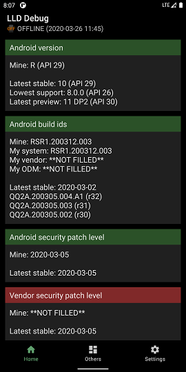
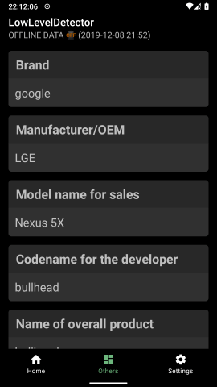
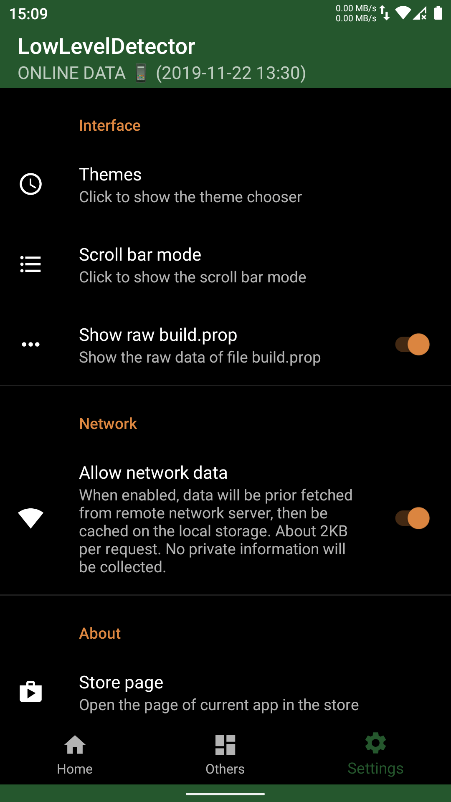

# AndroidLowLevelDetector
An open-source small utility to detect some Android low-level features.

## Download
- Approach 1
https://github.com/imknown/AndroidLowLevelDetector/releases
- Approach 2
https://coolapk.com/apk/net.imknown.android.forefrontinfo

## Screenshots
  

## Features inside
- detect Android version
- detect Security patch level
- detect Linux kernel
- detect A/B or A-Only
- detect Project Treble
- detect Vendor NDK and whether up-to-date
- detect System-as-root
- detect (flattened) APEX
- detect Toybox
- dark mode supported
- online/offline mode (fetching data from remote server or local)
- in-app check up and upgrade
- MultiWindow/FreeForm/Landscape supported

## Features todo
- JetPack
  - Architecture (MVVM, Lifecycle, ViewModel, LiveData, Navigation, etc.)
  - Animation & transitions
- detect dm-verity (version)
- detect FBE/FDE
- detect WebView implement
- up-to-date detect
  - latest alpha/beta Android version
- settings
  - speed mode (no animations, no CardViews, etc.)
  - detect `getprop` from file, not from SDK API (option)
  - root mode
  - show commands
  - custom commands
  - GAME???
  - network cache logic
  - select json server
- documents
  - development references
  - user-readable explanation why mine not supported
- copy result
- run custom commands
- licenses and acknowledge
- etc.
