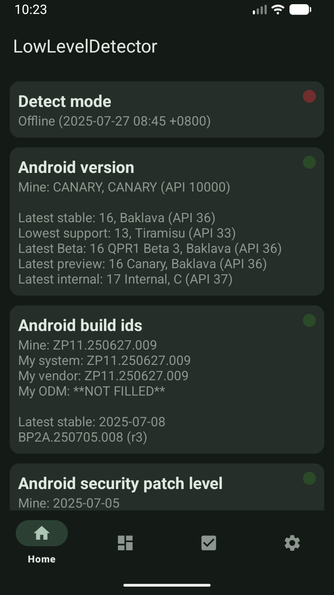
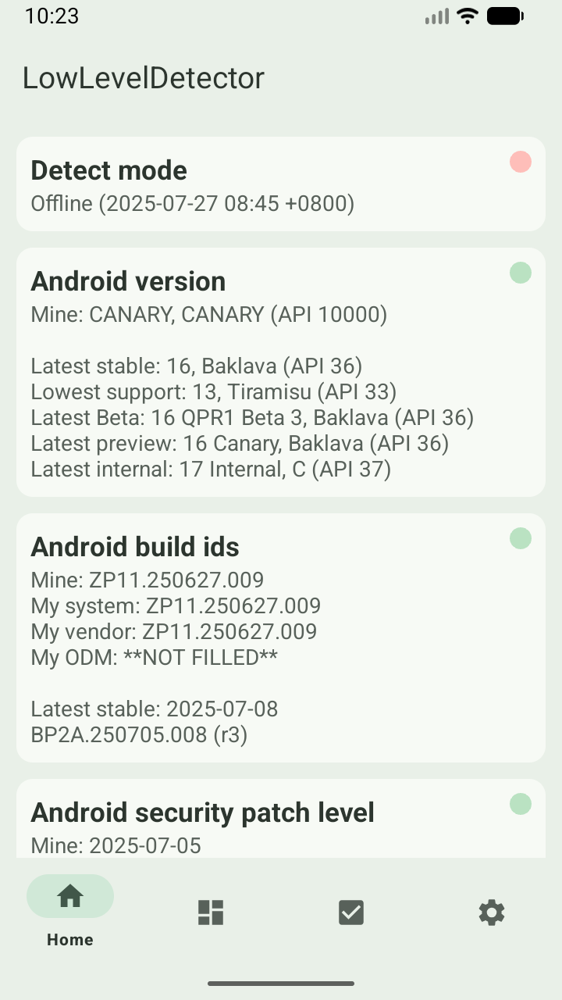

# AndroidLowLevelDetector

[](https://github.com/imknown/AndroidLowLevelDetector/actions/workflows/android-ci.yml)
[](https://github.com/imknown/AndroidLowLevelDetector/actions/workflows/dependabot/dependabot-updates)
[](https://github.com/imknown/AndroidLowLevelDetector/actions/workflows/dependency-submission.yml)

Detect Treble, GSI, Mainline, APEX, system-as-root(SAR), A/B, etc. .  
Some source codes refer to [Magisk][Magisk], [OpenGApps][OpenGApps], [TrebleInfo][TrebleInfo], [TrebleCheck][TrebleCheck], etc. .

[Magisk]:https://github.com/topjohnwu/Magisk
[OpenGApps]:https://github.com/opengapps/opengapps
[TrebleInfo]:https://github.com/penn5/TrebleCheck
[TrebleCheck]:https://github.com/kevintresuelo/treble

 

## Source
1. https://github.com/imknown/AndroidLowLevelDetector
1. https://gitee.com/imknown/AndroidLowLevelDetector (Mirror)

## Download
1. https://play.google.com/store/apps/details?id=net.imknown.android.forefrontinfo
1. https://github.com/imknown/AndroidLowLevelDetector/releases
1. https://gitee.com/imknown/AndroidLowLevelDetector/releases (Mirror)

## Features
<details>
<summary>Click me</summary>

- Detect Android version
- Detect Android Build Id version
- Detect Android security patch level
- Detect Vendor security patch level
- Detect Project Mainline module version (Google Play system update)
- Detect Linux kernel
- Detect A/B or A-Only
- Detect Dynamic Partitions
- Detect Dynamic System Update(DSU)
- Detect Project Treble
- Detect GSI compatibility
- Detect Binder bitness
- Detect Process/VM architecture
- Detect Vendor NDK
- Detect System-as-root
- Detect (flattened) APEX
- Detect Toybox
- Detect WebView implement
- Detect outdatedTargetSdkVersion apk
- Dark mode supported
- Online/offline mode (fetching data from remote server or local)
- MultiWindow/FreeForm/Foldable/Landscape supported
- Etc.

</details>

## Contribute
Just use `Pull Request`.  
Translations are also welcome.

## Build
### Flavor
- Firebase  
The Google Play version.  
Will collect your information then upload,  
using Firebase Analytics & Crashlytics.  
Follow Firebase Official Guide.  
See [Privacy Policy][Privacy Policy].

- FOSS (Default)  
Will **NOT** collect your information.  
See [Free and open-source software][FOSS].

[Privacy Policy]: /GOOGLE_PLAY_PRIVACY_POLICY.md
[FOSS]: https://en.wikipedia.org/wiki/Free_and_open-source_software

### Release
Provide the whole following properties in file `$rootDir/local.properties`:

``` ini
storeFile=<Yours>
storePassword=<Yours>
keyAlias=<Yours>
keyPassword=<Yours>
```

The location of `storeFile` can be `../keys/release.jks`.  
It has been already ignored in file `$rootDir/.gitingore` by default.  
So you can put your own private certificate or signing key there safely.
