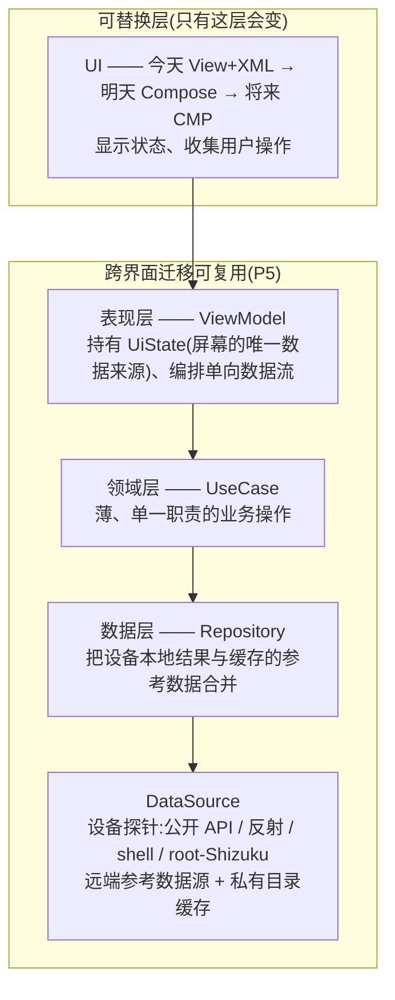
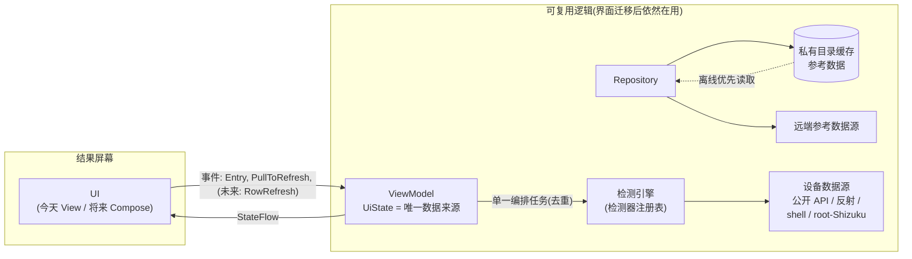
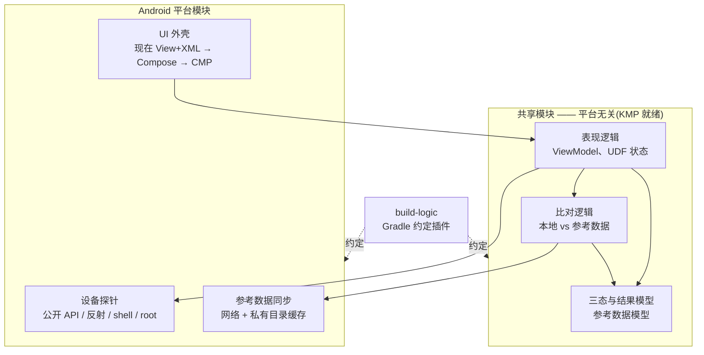

# 04 — 架构与决策

属于《[LowLevelDetector 规格文档](README.md)》(中文整理版)。

## 1. 引言与架构原则

### 1.1 目的

本文给出能满足本规格的架构:分层、检测引擎、状态管理、模块划分、关键技术决策(附理由),以及从现状到目标的迁移路径。

### 1.2 架构原则(干系人指定)

下面这些原则是本规格里**级别最高的规矩**。局部设计跟原则打架时,原则赢。

| # | 原则 | 含义 |
|---|---|---|
| P1 | **SSOT** —— 唯一数据来源 | 每份状态只有一个地方说了算;其他地方只能看它。不存在两份各说各话的状态。 |
| P2 | **UDF** —— 单向数据流 | 用户的操作往下传(UI → 逻辑),状态往上流(逻辑 → UI)。状态绝不会被两个方向同时改。 |
| P3 | **人类与 AI 都好找路** | 代码库必须让人类和 AI 编程助手都看得懂、改得动。具体做法:命名可预测、接口尽量少、**按特性放在一起**(P4)。 |
| P4 | **按特性放在一起** | 属于同一个业务特性的全部代码放在同一个地方(同一个包 / 模块)。一个特性的界面、状态、逻辑绝不分散到相距很远的目录(比如「所有界面在这边、所有网络在那边」)。 |
| P5 | **界面层可替换** | ViewModel + UseCase + Repository + DataSource 各层在换界面技术(View+XML → Compose → CMP)时原样复用。被换掉的只有 View 层。 |
| P6 | **先把正确性修好,再谈迁移** | Compose 不是换个框架就万事大吉。看得见的缺陷先在现在的 View 体系下修好;迁移要在健康的底子上做。 |
| P7 | **失败只隔离一条,退要有路可退** | 任何单个检测条目失败都不影响其他条目(SRS FR-6);每个能力层级都要能平稳退回(SRS FR-9)。 |

### 1.3 本篇的非目标

- 像素级的界面规格 —— 用户可见的文案属于发布期从 SRS 生成的产物,不当成维护用的文档(负责人决定,2026-09-05)。
- 条目级检测目录的正式定义(《[检测条目目录](05-detection-item-catalog.md)》,TBD)。
- 构建 / CI 流水线的细节(需要时再单独规定)。

## 2. 现状(As-Is)

按负责人的说明记录;这里只是划定迁移的**起点**,不代表认可现状。

- **UI**:单 Activity + 多 Fragment,View + XML 布局(Fragment 自己管导航;**Navigation3** 故意留到 Compose 迁移时再用)。
- **模块(多模块)**:`:app`(应用外壳)、**binder-detector** 特性模块、**base** 模块,以及 **`build-logic`**(Gradle 约定插件)。负责人承认这个划分相对 P4 **还没理顺**。截至 2026-09-06,binder-detector 模块只有一个源文件 `BinderDetector.kt`。
- **产品变体**:两个构建变体 —— **`firebase`**(集成 Firebase Crashlytics + Analytics,会收集用户信息)与 **`foss`**(无专有 SDK、不收集)。发布:`firebase` → Google Play + GitHub Releases;`foss` → GitHub Releases。
- **依赖注入**:没有(手工组装);负责人有意等 KMP 就绪后的目标形态。
- **已知问题**:正确性缺陷(包括生命周期 / 重建处理)正在 View 体系下一步步修 —— 和 P6 一致。

## 3. 目标架构(To-Be)

### 3.1 分层(应用于特性*内部*)

这些层的边界存在于**每个特性自己的目录树里**(P4):不存在全局的「所有 ViewModel 都放这儿」这种包。跨特性共用的东西(三态模型、检测器抽象、缓存格式)放在共享的稳定包里。

**UseCase** 层故意做薄:它只包一个可复用的业务操作(比如「跑一次完整检测」「同步参考数据」),让 ViewModel 保持精简、业务逻辑不绑定界面技术、操作能单独测试。不是每个屏幕都需要;每个可复用的编排配一个。

### 3.2 单向数据流

规则:

1. **操作往下传**:`Entry`(进入屏幕自动跑一次,FR-4)、`PullToRefresh`(FR-5)、将来的 `RowRefresh`(BL-3)。
2. **同一时刻只有一个检测任务**:ViewModel 同一时刻最多跑一个检测任务;重复触发直接忽略(FR-4 AC2、FR-5 AC2)。
3. **状态往上流**:界面是 `UiState` 的纯展示;加载图标显不显示、每条的三态值、每条的未知证据,全部**从状态算出来**,绝不藏在 View 里。
4. **重建安全**:检测任务和它的状态由**活得比 Activity/Fragment 重建更久**的对象保存;重建后的界面重新订阅、重新画当前状态,不重新触发工作(FR-4 AC1/AC3)。

### 3.3 检测引擎

引擎是一条**注册表驱动、能力分级、失败隔离**的流水线:

- **检测器契约**:目录里的每个条目(《[检测条目目录](05-detection-item-catalog.md)》)实现一个小契约 —— 自己是谁(id、类别、标题)、回答什么问题,以及返回**三态结果 + 证据**(读到的原始值、用的什么手段)的 `execute()`。
- **注册表**:检测器以列表 / 表的形式注册 —— 增删条目是改数据,不是改界面(FR-1 AC2)。目录和这份注册表预期一一对应。
- **能力分级**(FR-9):每个检测器声明自己用到哪些层级 —— 公开 API、隐藏 API 反射、shell 命令、root/Shizuku 增强。高层级是*可选的增强*:用不了就退到低层级,或者带着证据返回未知。缺某个层级绝不能造成误报「不支持」。
- **单条隔离**(FR-6):每个检测器的执行都包在自己的错误处理里;抛出的异常或读不到的值变成该条目的**未知**(附上抓到的证据)。故意**不做**那种一失败就整屏报错的顶层兜底。
- **并发**:检测器并发、有上限、可取消地跑;新的完整运行取消 / 无视还没跑完的旧工作,而不是跟它抢。**展示顺序固定,跟谁先跑完无关**;有数据依赖的检测器必须按依赖来(负责人裁定,2026-09-06)。
- **为将来留路 —— 查询开放(RM-3/4/5)**:检测用的基础能力故意保持小、只读、无副作用,这样同一套积木将来可以支撑用户自定义查询、对系统 / 语音助手的外部暴露(比如 Android AppFunctions)和 AI 原生代理 —— 且永远躲在「用户明确同意 / 安全边界」后面(SRS Q8)。这条不给当前版本增加任何工作量。

### 3.4 数据层

- **设备数据源**实现 §3.3 的能力分级,是*唯一*允许直接碰 Android 平台内部机制的代码。
- **参考数据源**(FR-7):网络开着时拉取服务端参考数据,写进**私有目录缓存**,并且始终*从缓存读*(离线优先)。同步成功就换上更新的;同步失败就留着过期缓存并记日志 —— 绝不算全局错误。
- **比对**(FR-7):repository 把本地检测结果和缓存的参考数据合在一起,用来核对 / 补充结论。具体比什么、怎么算「对不上」是开放问题(SRS Q2);设计上的要求是:比对发生在数据源**之上**,让两路输入都能单独测试。

### 3.5 状态、线程与生命周期模型

| 关注点 | 决定 |
|---|---|
| 状态归谁 | `UiState`(屏幕的唯一数据来源)在 ViewModel 里;参考数据的唯一来源在 repository / 缓存里。不留副本。 |
| 异步工具 | 协程 + `StateFlow`(任务是被触发的,状态是被观察的)。 |
| 任务作用域 | 检测任务跑在 ViewModel 持有的作用域里,所以**能在 Activity/Fragment 重建后活下来**(FR-4)。它绑的是进程 / ViewModel 的生命周期,不绑任何 View 的生命周期。 |
| 去重 | 每种运行同时最多一个在跑(现在是完整运行;以后可以单行);正在跑的时候新触发什么都不做(FR-4 AC2、FR-5 AC2)。 |
| 加载图标 | 状态里的一个字段,由界面照着画 —— 正因如此图标才能在整个运行期间可见,且重建后不卡死(FR-5 AC1)。 |
| 主线程 | 检测和 I/O 都不在主线程上跑;界面只负责画状态(NFR-3)。 |

### 3.6 依赖注入

- **现在**:没有 —— 手工构造组装。在 KMP 就绪的目标形态做出来之前保持简单(P6:不付两次迁移的代价)。
- **目标**:**Metro**(首选)—— 兼容 KMP、写法接近 Dagger2/Hilt 的 DI 框架;因为将来的模块拆分(§3.7)是 KMP 形态,Metro 支持它。书面记录的备选:**Hilt / Dagger2** —— 注解风格相同、和 AndroidX 集成好,但不支持 KMP,是 Metro 靠不住时有意接受的退路。
- **明确不用**:**Koin** —— 它的 Service Locator 模式和负责人的架构偏好冲突(要编译期就能验证的依赖关系)。

### 3.7 模块结构

**目标形态(CMP 就绪)** —— 平台相关的代码被隔离开,让共享逻辑能以最小改动迁往 Kotlin Multiplatform(确切模块数 TBD):

规则:

1. **按特性放在一起(P4)优先于按层分组**:一个检测器的探针、它的表现逻辑、它的比对逻辑,待在同一个地方。「界面模块在这、网络模块在那」这种分法被明确拒绝当主轴。
2. **共享模块不含 Android 专属 API**;任何 Android 特有的东西(探针、shell、缓存读写)留在平台模块,藏在共享代码定义的接口后面。
3. `build-logic` 放 Gradle 约定插件,模块再多也不用复制粘贴构建脚本。
4. 现有模块(`:app`、binder-detector 特性、`:base`)会搬进这个形态;`:base` 这种什么都装的大杂烩模块预期拆散、各回各家(P4)。
5. **变体是 sourceSet 级的,不是模块级的**:Firebase 集成只存在于 `firebase` 变体的 source set 下;`build-logic` 约定插件持有变体定义,并且要保护 `foss` 变体不受直接*和间接*的 Firebase 依赖(FR-10 AC1)。截至 2026-09-06,foss 侧的做法是配置作用域(`firebaseImplementation`)加禁用 foss 的 googleServices/Crashlytics 任务 —— 一个记录在案的临时办法(负责人,2026-09-06);第 6 节要求的类级验证还没做。

### 3.8 技术栈与版本策略

**版本策略 —— 所有版本号集中写在 Gradle Version Catalog;绝不散落在各模块的构建脚本里:**

| 规则 | 策略 |
|---|---|
| Android 平台(`compileSdk` / `targetSdk`) | 始终用最新的**平台稳定**(platform-stable)SDK 级别。平台稳定 ≠ 正式版:Android 通常在正式版之前若干个 **Beta** 里程碑就达到平台稳定 —— 那才是升级时点,不用等最终镜像。 |
| 构建工具链(AGP、Gradle、`BuildToolVersion` …) | 同一原则:跟最新平台稳定版。 |
| AndroidX 与 Kotlin 库 | 优先**稳定或 RC**。**不收 Beta** 当依赖基线 —— 尽管 Android 团队内部把 Beta 当生产可用(据 J. Wharton),本项目再保守一档。 |
| 版本声明 | 一律 **Gradle Kotlin DSL + Version Catalog**;`build-logic` 的约定插件使用这份目录。 |

**按用途的技术栈:**

| 用途 | 选择 | 说明 |
|---|---|---|
| 架构底线 | **SSOT + UDF,严格执行** | P1/P2;具体见 §3.2。 |
| 语言 | 全 **Kotlin** | —— |
| 界面承载(View 时代) | **单 Activity + 多 Fragment**,View + XML 布局 | Compose 迁移时整体换掉(P5)。 |
| 界面技术演进 | View+XML → **Jetpack Compose** → KMP/CMP | 迁移计划见第 7 节。 |
| 导航 | View 时代:维持 Fragment 导航;Compose 时代:**Navigation3** | 用 View 的期间故意**不**引入 Navigation3。 |
| 分层 | **View/Compose + ViewModel + UseCase + Repository + DataSource** | §3.1。 |
| 异步 | **kotlinx.coroutines + Flow** | §3.5。 |
| 网络 | **Ktor Client(OkHttp 引擎)** | FR-7 参考数据同步;debug 构建加 Ktor 日志。 |
| 序列化 | **kotlinx.serialization** | 同时为 RM-1 的导出格式打底。 |
| 持久化 | **DataStore + protobuf**(或等价的、防损坏的二进制存储) | 应用设置(如 FR-8 开关)和结构化本地数据。 |
| DI | **Metro** 首选;**Hilt / Dagger2** 书面备选 | ADR-003;§3.6。 |
| 图片加载 | **Coil** | 既定标准;项目目前没有图片要加载 —— 有需求了再用。 |
| 单元测试 | **JUnit 5 + MockK + Turbine** | Turbine 用来断言 Flow / 状态。 |
| UI 测试 | **Espresso**(View 时代)/ **Compose UI Test**(Compose 时代),辅以 **Robolectric** | 见第 6 节。 |
| 启动 | **Baseline Profiles + App Startup** | 启动优化。 |
| 内存与正确性 | **LeakCanary + StrictMode** | debug 构建。 |
| 基准 | **Macrobenchmark** | 跟踪启动 / 滚动的性能回退。 |
| 发布卫生 | **Strict R8** | 完整 minify/混淆 + 严格的 keep 规则。 |
| 布局 | **自适应布局** | 手机、平板、折叠屏、窗口缩放(SRS NFR-8)。 |

## 4. 关键决策(ADR 摘要)

| ADR | 决策 | 理由 | 被否掉的替代方案 |
|---|---|---|---|
| 001 | **架构按原则走(SSOT/UDF),不贴 MVVM/MVI 的标签** | 负责人的硬性要求是 SSOT、UDF、人类 + AI 都好找路。叫什么模式不如这些规矩重要;哪里用 MVVM 更清楚,哪里就长成 MVVM 的样子。 | 强推完整 MVI(到处 intents/reducers)—— 这个规模下只剩形式,没有好处。 |
| 002 | **现在 View+XML;以后 Compose/CMP;先在 View 下修正确性** | Compose 不是换个框架就万事大吉(P6);团队还不熟 Compose;ViewModel/UseCase/Repository/DataSource 不绑定界面技术,到时只换 View 层(P5)。 | 缺陷没修就迁 Compose —— 迁移会把缺陷焊死在里面,更难看清。 |
| 003 | **现在不引 DI 框架;以后用 Metro(KMP)—— Hilt/Dagger2 书面备选;不用 Koin** | 避免迁移两次;Metro 兼容 KMP、写法像 Dagger2/Hilt;Koin 的 Service Locator 模式明确不要。备选方案是防 Metro 靠不住。 | Koin(运行时 Service Locator);过早引 Hilt(到 KMP 时还得再迁一次)。 |
| 004 | **按特性放在一起,不按层分模块** | 一个业务特性必须在一处找得到(P3/P4);按技术层拆开让人和 AI 都难找路。 | 严格的层型模块(`:ui`、`:network` …)。 |
| 005 | **单条错误隔离;不做顶层兜底** | SRS FR-6:单个检测失败绝不能白屏;未知是带着证据的一等结果。 | 让整个列表跟着失败的全局 try/catch(明确拒绝)。 |
| 006 | **检测手段分能力层级** | FR-9:各层级的合法手段都欢迎;高层级是增强、可以平稳退回;缺层级不得误报「不支持」。 | 只用公开 API(丢信息);默认有 root(坑普通用户)。 |
| 007 | **离线优先的参考数据 + 私有目录缓存;联网由用户开关控制** | FR-7/FR-8:断网必须可用;缓存放应用私有目录;同步是增强,绝不是前提。 | 只在线校验(毁掉飞行模式下的可用性)。 |
| 008 | **注册表驱动的检测目录** | FR-1 AC2:《检测条目目录》和引擎注册表一一对应;增删条目是改数据。 | 每个条目硬编码的界面布局。 |
| 009 | **双变体 `foss`/`firebase`;遥测只在 `firebase`,默认开,目前无运行时关闭开关** | FOSS 分发要求没有专有追踪器;两个变体功能保持一致。FR-8 开关故意只管参考数据同步,不管遥测 —— 混在一个开关里会把两个信任模型不同的东西搅在一起。专门的运行时遥测开关是待办 BL-7。 | 单一「全网」总开关;两个变体都内置 Firebase(毁掉 FOSS 分发)。 |
| 010 | **SDK 版本跟平台稳定;AndroidX 基线只用稳定/RC(不收 Beta)** | 平台稳定早于正式版到来(常在 Beta 中段),跟平台稳定 SDK 既用得上新 API 又不冒进;库方面比 Android 内部「Beta=生产可用」再保守一档。所有版本号进 TOML version catalog。 | 钉死多年前的 SDK(用不上平台 API);收 Beta 库(回退频发)。 |

## 5. 错误处理策略

把隔离需求翻译成实现(FR-6 定需求,FR-14 定行内怎么显示)—— 从里到外三层:

1. **检测器边界(主要,FR-6)**:每个检测器的执行单独包一层;异常和读不到的值变成该条目的未知 + 证据 —— 打印进那一行的内容(FR-14)。其他一切保持各自的结果。
2. **Repository 边界(FR-7/FR-16)**:同步失败就继续用过期缓存 / 内置数据,并把原因记日志;绝没有全局错误。
3. **UI 边界(最后兜底)**:界面不含检测逻辑,所以没有失败可言;它只画现成的状态。条目级失败没有整屏错误状态 —— 「没有」本身是需求,不是漏了。

未知 / 失败时抓到的证据(试图读的原始值、能力层级、异常)现在记进日志,并留给 BL-1 单条详情展开用。

## 6. 测试策略

| 层级 | 验证什么 | 说明 |
|---|---|---|
| 单元 —— 检测器 | 三态映射、层级退回(无 root → 基础路径)、证据捕获 | 底层 API 有差异的地方,按 API 级别区分行为 |
| 单元 —— repository/比对 | 离线优先读取、过期缓存退回、json 版本合并(FR-16)、比对语义(Q2 定了之后) | 纯逻辑,不依赖 Android(对共享模块友好) |
| 单元 —— ViewModel/UDF | Entry/PullToRefresh 去重、加载图标在状态里的生命周期、失败的单条隔离 | 用「向同一个状态持有者重新订阅」来模拟界面重建 |
| 设备 / UI | 重建安全、fragment 懒加载 / 缓存 / 恢复(FR-13)、滚动隐藏行为(FR-12)、下拉刷新 | 直接执行 SRS 的验收标准 |
| 回归 | 目录变更不得影响无关条目的行为 | 注册表 golden 测试 |
| 构建 / 变体 | `foss` 和 `firebase` 都能构建并通过测试;验证 `foss` 里没有 Firebase 类;设置里有隐私政策入口 | 保障 FR-10 AC1/AC4 |
| 工具链 | 单元:JUnit 5 + MockK + Turbine;UI:Espresso(View 时代)→ Compose UI Test,JVM 上用 Robolectric;Macrobenchmark;debug 加 LeakCanary + StrictMode | 技术栈见 §3.8 |

## 7. 迁移计划

| 阶段 | 目标 | 内容 |
|---|---|---|
| **0 —— View 下的正确性**(进行中) | 健康的底子 | 在 View+XML 下修重建 / 加载 / 去重缺陷;不换界面技术的前提下引入检测引擎边界和状态归属。完成标准:FR-4/FR-5/FR-6 的验收标准在真机上成立。 |
| **1 —— 上 Compose** | 换掉 View 层 | 界面改用 Jetpack Compose,现有 ViewModel/UseCase/Repository/DataSource 原样复用(P5);导航用 **Navigation3**;UI 测试转向 Compose UI Test。 |
| **2 —— CMP 重构** | KMP 就绪形态 | 模块拆成共享(平台无关)+ Android 平台模块;上 Metro DI;为通用导出格式打基础(RM-1)。 |
| **3 —— 跨平台查看器** | 路线图 | 消费导出数据的 Compose Multiplatform 查看器(RM-2)。 |
| **4 —— 查询开放(探索)** | CMP 之后的愿景 | 用户自定义查询(RM-3);只读查询能力对外暴露,比如经 Android AppFunctions(RM-4);AI 原生交互(RM-5)。同意 / 安全模型(Q8)必须**先**于任何对外暴露就位。 |

## 8. 风险与缓解

| 风险 | 影响 | 缓解 |
|---|---|---|
| 未来的 Android 版本进一步收紧隐藏 API | 更多条目变成未知 | 能力分级 + 证据捕获让退回是明着来的、可排查的,绝不悄悄出错 |
| 厂商魔改产生错误结论 | 信任受损 | 和缓存的参考数据比对(FR-7);宁可未知,不要错误的肯定 / 否定 |
| CMP/KMP 生态变来变去 | 迁移返工 | 平台代码保持隔离;共享逻辑不依赖 Android |
| 只有一个人维护 | 修复变慢 | P3(AI 好找路的代码结构)把 AI 助手的干活效率用足;注册表驱动让加条目很便宜 |
| 比对语义(Q2)没定 | FR-7 定不了稿 | 设计上让比对坐在数据源之上;缓存格式带版本号,语义后定也不用迁数据 |
| 对外暴露查询(AppFunctions/语音助手)扩大隐私风险 | 敏感的设备信息可能在用户不知情时到达外部 | 只暴露只读能力;按能力划定范围、必须用户明确同意;Q8 安全模型定案前一律不暴露 |
| 参考数据 URL 写死在构建时的 `GIT_BRANCH` | 发布后若不更新分支,服务端 json 会过期 | 每次发布都更新该分支的 assets json,或者改成固定到 tag(裁定 2026-09-06) |
