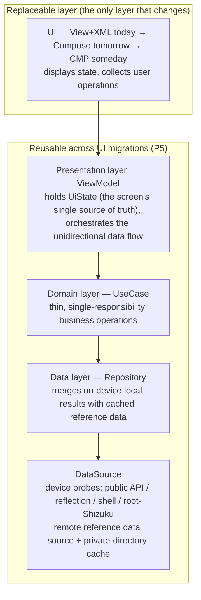
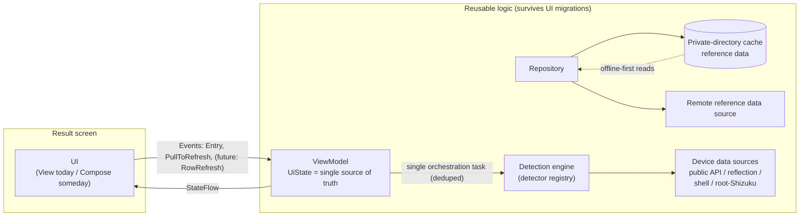
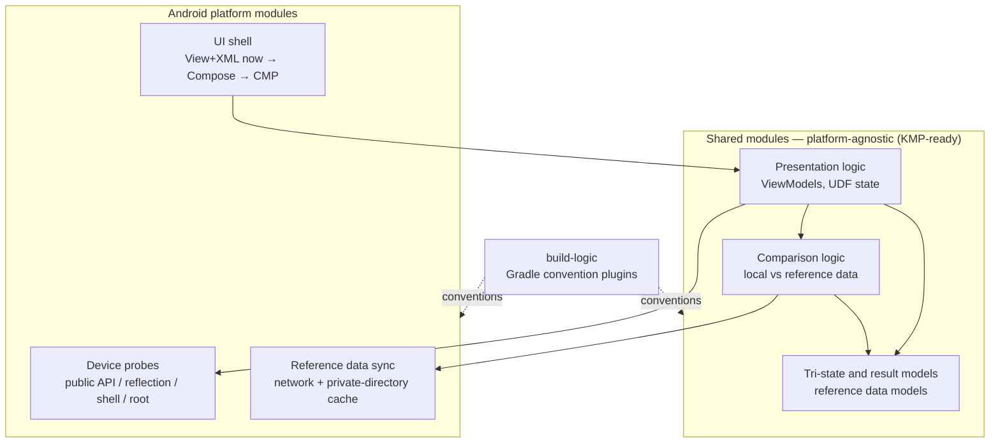

# 04 — Architecture and decisions

Part of the "[LowLevelDetector specification](README.md)".

## 1. Introduction and architecture principles

### 1.1 Purpose

This chapter gives the architecture that satisfies this specification: layering, the detection engine, state management, module division, key technical decisions (with rationales), and the migration path from today's state to the target.

### 1.2 Architecture principles (set by the stakeholder)

These principles are the **highest-ranking rules** in this specification. When a local design conflicts with a principle, the principle wins.

| # | Principle | Meaning |
|---|---|---|
| P1 | **SSOT** — single source of truth | Each piece of state has exactly one authoritative place; everywhere else only reads it. No two copies disagreeing. |
| P2 | **UDF** — unidirectional data flow | User operations travel downward (UI → logic), state flows upward (logic → UI). State is never written from both directions at once. |
| P3 | **Easy for humans and AI to navigate** | The codebase must be readable and changeable by both humans and AI coding assistants. Concrete means: predictable naming, as few interfaces as possible, **kept together by feature** (P4). |
| P4 | **Kept together by feature** | All code belonging to one business feature lives in one place (one package / module). A feature's UI, state, and logic never scatter across distant directories (e.g. "all screens here, all networking there"). |
| P5 | **The UI layer is replaceable** | The ViewModel + UseCase + Repository + DataSource layers are reused unchanged when the UI technology changes (View+XML → Compose → CMP). Only the View layer gets swapped. |
| P6 | **Fix correctness first, then migrate** | Compose is not a framework swap that solves everything. Visible defects get fixed under today's View system first; migration happens on a healthy base. |
| P7 | **Isolate failures to one item; every fallback has a way down** | Any single detection item's failure never affects the others (SRS FR-6); every capability tier can degrade gracefully (SRS FR-9). |

### 1.3 Non-goals of this chapter

- Pixel-level UI specs — user-facing copy is a release-time artifact generated from the SRS, not a maintained document (owner's decision, 2026-09-05).
- The official item-level detection catalog ("[Detection item catalog](05-detection-item-catalog.md)", finalized 2026-09-22; not repeated here).
- Build / CI pipeline details (specified separately when needed).

## 2. Current state (As-Is)

Recorded from the owner's account; this only marks the **starting point** of the migration and does not endorse the current state.

- **UI**: one Activity + multiple Fragments, View + XML layouts (fragments manage navigation themselves; **Navigation 3** is deliberately reserved for the Compose migration).
- **Modules (multi-module)**: `:app` (app shell), the **binder-detector** feature module, the **base** module, and **`build-logic`** (Gradle convention plugins). The owner acknowledges this division is **not yet sorted out** relative to P4. As of 2026-09-06, the binder-detector module has a single source file `BinderDetector.kt`.
- **Product variants**: two build variants — **`firebase`** (integrates Firebase Crashlytics + Analytics, collects user information) and **`foss`** (no proprietary SDKs, no collection). Distribution: `firebase` → Google Play + GitHub Releases; `foss` → GitHub Releases.
- **Dependency injection**: none (manual assembly); the owner deliberately waits for the target shape once KMP is ready.
- **Known issues**: correctness defects (including lifecycle / recreation handling) are being fixed step by step under the View system — consistent with P6.

## 3. Target architecture (To-Be)

### 3.1 Layering (applied *inside* each feature)

These boundaries exist **inside each feature's own directory tree** (P4): there is no global "all ViewModels live here" package. Cross-feature shared things (the tri-state model, detector abstractions, the cache format) live in shared, stable packages.

The **UseCase** layer is deliberately thin: it wraps one reusable business operation (e.g. "run a full detection", "sync reference data"), keeping the ViewModel lean, keeping business logic independent of the UI technology, and making operations testable in isolation. Not every screen needs one; one per reusable orchestration.

### 3.2 Unidirectional data flow

Rules:

1. **Operations travel down**: `Entry` (auto-run once on screen entry, FR-4), `PullToRefresh` (FR-5), and the future `RowRefresh` (BL-3).
2. **Only one detection task at a time**: a ViewModel runs at most one detection task at any moment; repeated triggers are ignored (FR-4 AC2, FR-5 AC2).
3. **State flows up**: the UI is a pure rendering of `UiState`; whether the loading icon shows, each item's tri-state value, each item's unknown evidence — all **computed from state**, never hidden in the View.
4. **Recreation-safe**: the detection task and its state are held by objects that **outlive Activity/Fragment recreation**; the recreated UI re-subscribes and re-draws the current state without re-triggering work (FR-4 AC1/AC3).

### 3.3 Detection engine

The engine is a **registry-driven, tiered-capability, failure-isolated** pipeline:

- **Detector contract**: every item in the catalog ("[Detection item catalog](05-detection-item-catalog.md)") implements a small contract — who it is (id, category, title), what question it answers, and an `execute()` that returns a **tri-state result + evidence** (the raw value read, the means used).
- **Registry**: detectors register as a list / table — adding or removing items is a data change, not a UI change (FR-1 AC2). The catalog and this registry are expected to correspond one-to-one.
- **Capability tiers** (FR-9): each detector declares which tiers it uses — public API, hidden-API reflection, shell commands, root/Shizuku enhancement. Higher tiers are *optional enhancements*: unavailable tiers fall back to lower ones, or return unknown with evidence. A missing tier must never produce a false "unsupported".
- **Per-item isolation** (FR-6): each detector's execution is wrapped in its own error handling; thrown exceptions or unreadable values become that item's **unknown** (with the captured evidence). Deliberately **no** top-level catch-all that errors the whole screen on one failure.
- **Concurrency**: detectors run concurrently, bounded, and cancellable; a new full run cancels or discards unfinished old work instead of racing it. **Display order is fixed, regardless of completion order**; detectors with data dependencies must honor them.
- **Paving the way for the future — query opening (RM-3/4/5)**: the basic detection capabilities stay small, read-only, and side-effect free, so the same building blocks can later support user-defined queries, external exposure to systems / assistants (e.g. Android AppFunctions), and native AI agents — always behind "explicit user consent / a security boundary" (SRS Q8). This adds no work to the current version.

### 3.4 Data layer

- **Device data sources** implement §3.3's capability tiers and are the *only* code allowed to touch Android platform internals directly.
- **Reference data source** (FR-7): when the network is on, fetch server reference data into the **private-directory cache**, and always *read from the cache* (offline-first). A successful sync swaps in the fresher data; a failed sync keeps the stale cache and logs — never a global error.
- **Comparison** (FR-7): the repository merges local detection results with cached reference data to cross-check / supplement conclusions. What exactly is compared and what counts as "mismatch" is an open question (SRS Q2); the design requirement is: comparison sits **above** the data sources so both inputs can be tested independently.

### 3.5 State, threading, and lifecycle model

| Concern | Decision |
|---|---|
| Who owns state | `UiState` (the screen's single source of truth) lives in the ViewModel; the single source of reference data lives in the repository / cache. No copies left behind. |
| Async tooling | Coroutines + `StateFlow` (tasks are triggered, state is observed). |
| Task scope | Detection tasks run in a scope the ViewModel holds, so they **survive Activity/Fragment recreation** (FR-4). They bind to the process / ViewModel lifecycle, not to any View's lifecycle. |
| Dedup | At most one run of each kind at a time (today: full runs; single-row later); a new trigger during a run does nothing (FR-4 AC2, FR-5 AC2). |
| Loading icon | A field in state that the UI draws — which is exactly why the icon stays visible for the whole run and never hangs after recreation (FR-5 AC1). |
| Main thread | Detection and I/O never run on the main thread; the UI only draws state (NFR-3). |

### 3.6 Dependency injection

- **Now**: none — manual construction and assembly. Keep it simple until the KMP-ready target shape exists (P6: don't pay the migration cost twice).
- **Target**: **Metro** (preferred) — a KMP-compatible DI framework in the Dagger2/Hilt style; because the future module split (§3.7) is KMP-shaped, Metro supports it. Written-down alternatives: **Hilt / Dagger2** — same annotation style, good AndroidX integration, but no KMP support; the deliberately accepted fallback if Metro doesn't pan out.
- **Explicitly not used**: **Koin** — its Service Locator pattern conflicts with the owner's architecture preference (dependencies verifiable at compile time).

### 3.7 Module structure

**Target shape (CMP-ready)** — platform-specific code is isolated so shared logic can migrate to Kotlin Multiplatform with minimal changes (exact module count TBD):

Rules:

1. **Kept together by feature (P4) beats grouping by layer**: a detector's probes, its presentation logic, and its comparison logic stay in one place. A "screens module here, networking module there" split is explicitly rejected as the main axis.
2. **Shared modules contain no Android-only APIs**; anything Android-specific (probes, shell, cache reads/writes) stays in platform modules behind interfaces the shared code defines.
3. `build-logic` holds the Gradle convention plugins, so no matter how many modules there are, build scripts are never copy-pasted.
4. Existing modules (`:app`, the binder-detector feature, `:base`) move into this shape; the grab-bag `:base` module is expected to be split up, each part going home (P4).
5. **Variants are source-set level, not module level**: Firebase integration exists only under the `firebase` variant's source set; the `build-logic` convention plugin owns the variant definitions and must protect the `foss` variant from direct *and indirect* Firebase dependencies (FR-10 AC1). As of 2026-09-06 the foss approach is configuration scoping (`firebaseImplementation`) plus disabling foss's googleServices/Crashlytics tasks — a documented stopgap (owner, 2026-09-06); the class-level verification required by section 6 has not been done.

### 3.8 Tech stack and version strategy

**Version strategy — every version number lives centrally in the Gradle Version Catalog; never scattered across module build scripts:**

| Rule | Strategy |
|---|---|
| Android platform (`compileSdk` / `targetSdk`) | Always the latest **platform-stable** SDK level. Platform-stable ≠ final release: Android usually reaches platform stability at some **Beta** milestone before the final release — that is the upgrade moment; no waiting for the final image. |
| Build toolchain (AGP, Gradle, `BuildToolVersion` ...) | Same principle: follow the latest platform-stable. |
| AndroidX and Kotlin libraries | Prefer **stable or RC**. **No Beta** in the dependency baseline — even though the Android team treats Beta as production-ready internally (per J. Wharton), this project is one notch more conservative. |
| Version declarations | Always **Gradle Kotlin DSL + Version Catalog**; the `build-logic` convention plugins consume this catalog. |

**Tech stack by purpose:**

| Purpose | Choice | Notes |
|---|---|---|
| Architecture baseline | **SSOT + UDF, strictly enforced** | P1/P2; see §3.2. |
| Language | All **Kotlin** | — |
| UI host (View era) | **Single Activity + multiple Fragments**, View + XML layouts | Replaced wholesale during the Compose migration (P5). |
| UI technology evolution | View+XML → **Jetpack Compose** → KMP/CMP | Migration plan in section 7. |
| Navigation | View era: keep Fragment navigation; Compose era: **Navigation 3** | Deliberately **no** Navigation 3 while on View. |
| Layering | **View/Compose + ViewModel + UseCase + Repository + DataSource** | §3.1. |
| Async | **kotlinx.coroutines + Flow** | §3.5. |
| Networking | **Ktor Client (OkHttp engine)** | FR-7 reference data sync; Ktor logging on debug builds. |
| Serialization | **kotlinx.serialization** | Also lays the groundwork for RM-1's export format. |
| Persistence | **DataStore + protobuf** (or an equivalent corruption-resistant binary store) | App settings (e.g. the FR-8 switch) and structured local data. |
| DI | **Metro** preferred; **Hilt / Dagger2** the written fallback | ADR-003; §3.6. |
| Image loading | **Coil** | The established standard; nothing to load today — use it when a need appears. |
| Unit tests | **JUnit 5 + MockK + Turbine** | Turbine for asserting Flows / state. |
| UI tests | **Espresso** (View era) / **Compose UI Test** (Compose era), backed by **Robolectric** | See section 6. |
| Startup | **Baseline Profiles + App Startup** | Startup optimization. |
| Memory and correctness | **LeakCanary + StrictMode** | Debug builds. |
| Benchmarks | **Macrobenchmark** | Track startup / scroll performance regressions. |
| Release hygiene | **Strict R8** | Full minify/obfuscation + strict keep rules. |
| Layout | **Adaptive layouts** | Phone, tablet, foldable, window resizing (SRS NFR-8). |

## 4. Key decisions (ADR summary)

| ADR | Decision | Rationale | Rejected alternatives |
|---|---|---|---|
| 001 | **Architecture follows principles (SSOT/UDF), not MVVM/MVI labels** | The owner's hard requirements are SSOT, UDF, and code easy for humans + AI to navigate. What the pattern is called matters less than those rules; wherever MVVM is clearer, it can grow into MVVM's shape. | Imposing full MVI (intents/reducers everywhere) — at this size it is form without benefit. |
| 002 | **View+XML now; Compose/CMP later; fix correctness under View first** | Compose is not a framework swap that solves everything (P6); the team is not yet fluent in Compose; ViewModel/UseCase/Repository/DataSource do not bind to UI technology, so only the View layer gets swapped later (P5). | Migrating to Compose with defects unfixed — migration would weld the defects in and make them harder to see. |
| 003 | **No DI framework now; Metro later (KMP) — Hilt/Dagger2 as written fallback; no Koin** | Avoid migrating twice; Metro is KMP-compatible and Dagger2/Hilt-like; Koin's Service Locator pattern is explicitly out. The fallback exists in case Metro doesn't pan out. | Koin (runtime Service Locator); adopting Hilt too early (another migration at KMP time). |
| 004 | **Kept together by feature, not split into layer modules** | A business feature must be findable in one place (P3/P4); splitting by technical layer makes navigation hard for both humans and AI. | Strict layer modules (`:ui`, `:network` ...). |
| 005 | **Per-item error isolation; no top-level catch-all** | SRS FR-6: a single detection failure must never blank the screen; unknown is a first-class result carrying evidence. | A global try/catch that fails the whole list (explicitly rejected). |
| 006 | **Detection means tiered by capability** | FR-9: every lawful tier is welcome; higher tiers are enhancements with graceful fallback; a missing tier must not falsely report "unsupported". | Public APIs only (loses information); assuming root (hurts ordinary users). |
| 007 | **Offline-first reference data + private-directory cache; networking behind a user switch** | FR-7/FR-8: it must work with no network; the cache lives in the app's private directory; sync is an enhancement, never a precondition. | Online-only validation (destroys airplane-mode usability). |
| 008 | **Registry-driven detection catalog** | FR-1 AC2: the "detection item catalog" corresponds one-to-one with the engine registry; adding/removing items is a data change. | Hardcoded UI layouts per item. |
| 009 | **Two variants `foss`/`firebase`; telemetry only in `firebase`, on by default, no runtime switch today** | FOSS distribution requires no proprietary trackers; both variants keep identical features. The FR-8 switch deliberately governs reference data sync only, not telemetry — mixing them in one switch would tangle two trust models. A dedicated runtime telemetry switch is backlog BL-7. | A single master "all network" switch; Firebase built into both variants (destroys FOSS distribution). |
| 010 | **SDK follows platform stability; AndroidX baseline stable/RC only (no Beta)** | Platform stability arrives before the final release (often mid-Beta); following platform-stable SDKs gets new APIs without being reckless; for libraries, one notch more conservative than Android's internal "Beta = production-ready". All version numbers go into the TOML version catalog. | Pinning years-old SDKs (missing platform APIs); accepting Beta libraries (frequent regressions). |

## 5. Error handling strategy

Translating the isolation requirement into implementation (FR-6 defines the requirement, FR-14 defines inline display) — three layers, inside out:

1. **Detector boundary (primary, FR-6)**: each detector's execution gets its own wrapper; exceptions and unreadable values become that item's unknown + evidence — printed into that row's content (FR-14). Everything else keeps its own result.
2. **Repository boundary (FR-7/FR-16)**: a failed sync keeps using the stale cache / bundled data and logs the reason; never a global error.
3. **UI boundary (last resort)**: the UI contains no detection logic, so it cannot fail; it only draws ready-made state. There is no screen-wide error state for item-level failures — the *absence* is itself a requirement, not an omission.

Evidence captured on unknown / failure (the raw value attempted, the capability tier, the exception) is logged today and reserved for BL-1's per-item detail expansion.

## 6. Test strategy

| Layer | Verifies | Notes |
|---|---|---|
| Unit — detectors | Tri-state mapping, tier fallback (no root → base path), evidence capture | Where low-level APIs differ, behavior varies by API level |
| Unit — repository / comparison | Offline-first reads, stale-cache fallback, json version merge (FR-16), comparison semantics (once Q2 is settled) | Pure logic, no Android dependency (friendly to shared modules) |
| Unit — ViewModel / UDF | Entry/PullToRefresh dedup, the loading icon's lifecycle in state, per-item failure isolation | Simulate UI recreation by "re-subscribing the same state holder" |
| Device / UI | Recreation safety, fragment lazy load / cache / restore (FR-13), scroll-hide behavior (FR-12), pull-to-refresh | Directly executes the SRS's acceptance criteria |
| Regression | Catalog changes must not affect unrelated items' behavior | Registry golden tests |
| Build / variants | `foss` and `firebase` both build and pass tests; verify `foss` has no Firebase classes; settings expose the privacy policy entry | Upholds FR-10 AC1/AC4 |
| Toolchain | Unit: JUnit 5 + MockK + Turbine; UI: Espresso (View era) → Compose UI Test, Robolectric on the JVM; Macrobenchmark; LeakCanary + StrictMode on debug | See §3.8 for the stack |

## 7. Migration plan

| Stage | Goal | Content |
|---|---|---|
| **0 — Correctness under View** (in progress) | A healthy base | Fix recreation / loading / dedup defects under View+XML; introduce the detection engine boundary and state ownership without changing UI technology. Done when FR-4/FR-5/FR-6's acceptance criteria hold on a real device. |
| **1 — Compose** | Replace the View layer | Move the UI to Jetpack Compose, reusing the existing ViewModel/UseCase/Repository/DataSource unchanged (P5); navigation uses **Navigation 3**; UI tests move to Compose UI Test. |
| **2 — CMP refactor** | KMP-ready shape | Split modules into shared (platform-agnostic) + Android platform modules; adopt Metro DI; lay groundwork for the generic export format (RM-1). |
| **3 — Cross-platform viewer** | Roadmap | A Compose Multiplatform viewer consuming exported data (RM-2). |
| **4 — Query opening (exploration)** | Vision after CMP | User-defined queries (RM-3); read-only query capabilities exposed externally, e.g. via Android AppFunctions (RM-4); native AI interaction (RM-5). The consent / security model (Q8) must be in place **before** any external exposure. |

## 8. Risks and mitigations

| Risk | Impact | Mitigation |
|---|---|---|
| Future Android versions further tighten hidden APIs | More items become unknown | Capability tiers + evidence capture make fallbacks explicit and debuggable, never silently wrong |
| Vendor modifications produce wrong conclusions | Trust damaged | Compare against cached reference data (FR-7); prefer unknown over a wrong yes/no |
| The CMP/KMP ecosystem keeps shifting | Migration rework | Platform code stays isolated; shared logic depends on nothing Android |
| Single maintainer | Slower fixes | P3 (AI-navigable structure) maximizes AI assistant productivity; the registry makes adding items cheap |
| Comparison semantics (Q2) unsettled | FR-7 cannot be finalized | Design comparison to sit above the data sources; the cache format carries a version, so late semantics need no data migration |
| External query exposure (AppFunctions / voice assistants) widens privacy risk | Sensitive device information may reach outside without the user knowing | Expose read-only capabilities only; scope per capability with explicit user consent; nothing exposed before the Q8 security model is settled |
| The reference data URL is pinned to the build-time `GIT_BRANCH` | If the branch isn't updated after release, the server json goes stale | Update that branch's assets json on every release, or pin to a tag instead (ruled 2026-09-06) |
